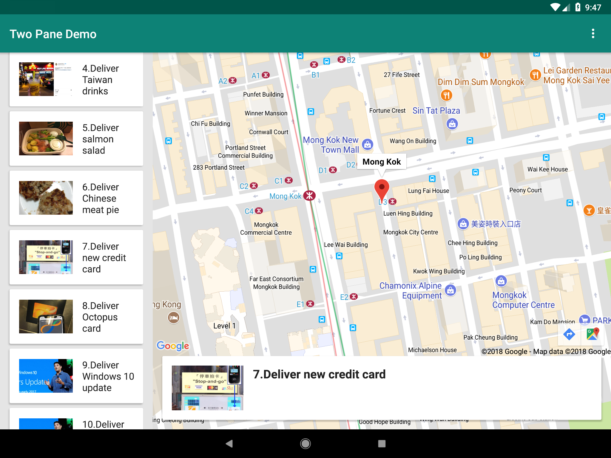
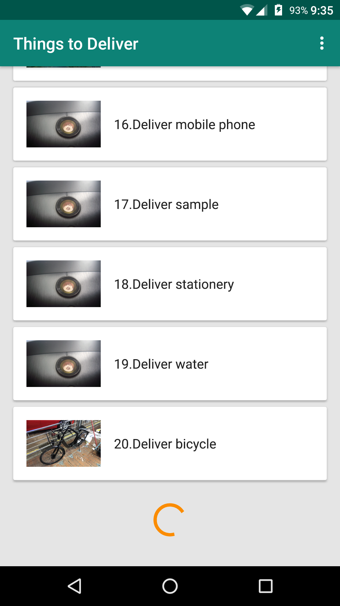
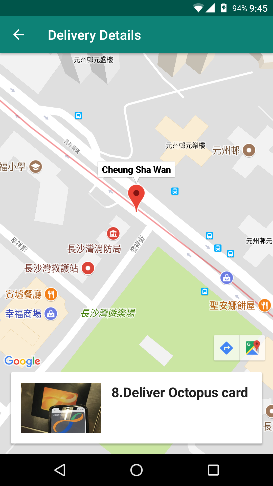

# Two-pane demo

Just a demo project.

## Configuration

Before building the app, you need to [obtain an API key](https://developers.google.com/maps/documentation/android/start#get-key) for Google Maps API.

Once you obtained the key, create a new file *credentials.properties* for defining the server endpoint and the key:

```
apiEndpoint=http://127.0.0.1:8080
googleMapsApiKey=AIzaxxxxxxxxxxxxxxxxxxxxxxxx
```

# Screenshots

More screenshots are available in *screenshots* directory.





